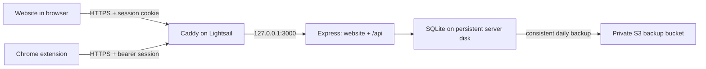

# CP Notes: AWS Beta Build Plan

Status: website and extension published; shared beta signup deployed on 2026-10-03 with schema-4 migration, backup restoration, restart persistence, and the live signup page verified. A real tester's complete onboarding exercise remains pending.
Implementation evidence: [release checklist](deploy/RELEASE_CHECKLIST.md).
Prepared: 2026-09-27.
Audience: up to 30 shared-link beta signups, alongside existing or individually invited accounts.
Purpose: publish a useful beta, collect feedback, and keep development and operating costs small.

Approved scope addendum (2026-09-28): [invitation links implementation plan](INVITATION_LINKS_PLAN.md) adds operator-issued account setup links so testers can choose their own passwords. Local implementation and verification are recorded there and in the [release checklist](deploy/RELEASE_CHECKLIST.md); actual rollout remains pending. This extends manual account creation without enabling public registration or automated email delivery.

This document is the implementation checklist. Creating it does not deploy the app, create AWS resources, migrate the existing database, or change application behavior.

Implementation addendum (2026-10-03): [shared beta signup plan](SHARED_BETA_SIGNUP_PLAN.md) describes a reusable, expiring link capped at 30 new shared-link accounts, with the count preserved across link replacements. This extends the original recruitment scope; existing accounts and individual invitations remain supported. The feature is deployed; [release evidence](deploy/RELEASE_CHECKLIST.md#shared-beta-lightsail-rollout-2026-10-03) distinguishes verified production checks from the pending first-tester exercise.

## 1. Release objective

A tester can sign in, install the Chrome extension, capture a question from LeetCode or an existing supported site, save a note, and retrieve and edit that note on the website. Their notes stay private and survive app restarts and deployments. Feedback is accessible from both the website and extension.

Keep the existing React/Vite website, Express backend, npm workspaces, Zod validation, and better-sqlite3 database. Use one AWS server and one database file.

## 2. Baseline and current status

The table below records the original baseline. The checked milestone items reflect implemented and locally verified changes; unchecked operating/distribution items still need the actual release environment.

| Area | What exists | Required change |
| --- | --- | --- |
| Backend | Express API bound to localhost; health endpoint; structured JSON errors | Authentication, user ownership, production static hosting, proxy configuration |
| Database | SQLite schema version 1; WAL, foreign keys, transactions, indexes | Accounts, sessions, ownership migration, user-scoped queries and indexes |
| Website | Diary, search, mistake statistics, editing and deletion | Login, logout, password change, onboarding, feedback link, hosted error messages |
| Extension | Popup capture, active-tab title detection, localhost backend setting | Hosted API, login, saved session, LeetCode detection, draft recovery |
| Supported sites | Codeforces, CodeChef, AtCoder, and manual Other | LeetCode as a recognized platform |
| Verification | Vitest, Supertest, React Testing Library; root `npm run check` | Isolation, auth, migration, LeetCode, deployment and recovery coverage |
| Deployment | Local setup instructions only | AWS configuration, repeatable releases, HTTPS, backups and restore instructions |

The folder is now verified to be a Git checkout, and deployment files are under `deploy/`. Verify that the remote repository is private before sharing releases. Database files, secrets, build output and backup artifacts remain excluded.

Paths in this document are relative to the repository unless they describe the target Linux server.

## 3. Architecture and decisions



| Decision | Choice for the beta | Reason and trade-off |
| --- | --- | --- |
| AWS hosting | One Linux Lightsail instance, initially 1 GB RAM with public IPv4 | Predictable bundled cost; we maintain the server. Verify memory under the actual workload. |
| API and website | One domain; Express serves the built website and `/api` | One deployment and simpler browser sessions |
| HTTPS | Caddy in front of Express | Certificate renewal and a small proxy configuration; adds one standard system service |
| Database | Existing SQLite and direct SQL | Fits the current code and workload; requires a persistent local disk and one app instance |
| Authentication | Individual email/password accounts created by an operator | No signup or email delivery service; password resets are manual |
| Sessions | Random, expiring, revocable tokens backed by SQLite | No JWT refresh-token system or Redis |
| Data ownership | Private notes and private saved problems per user | Avoid shared metadata and editing rules |
| Operations | systemd, simple deployment instructions, daily backup timer | No container orchestration or infrastructure framework required |

The single-server design has brief downtime during some updates and no automatic failover. Moving to multiple app servers would require a deliberate database change. Keep SQL inside the existing database module and keep AWS-specific work in deployment files so that move remains manageable.

On Lightsail, Express can remain bound to `127.0.0.1`; Caddy is the public entry point. Port 3000 should not be exposed to the internet.

### AWS budget and account prerequisites

The current Lightsail Linux bundle with 1 GB RAM, 40 GB SSD, and public IPv4 is listed at $7/month. Six months of the base server is $42. Plan roughly $8-10/month including a small backup allowance, excluding domain registration, taxes, and unexpected usage; this is an estimate, not a spending cap. [AWS pricing](https://aws.amazon.com/lightsail/pricing/)

The user reports approximately $100 in AWS starter credits. Confirm the actual remaining balance, eligible services, account plan, and expiry in Billing before provisioning. The Free account plan ends six months from signup or when credits run out; Free Tier credits expire twelve months from account creation. An account upgrade permits paid charges and is a separate account decision. [AWS Free Tier terms](https://aws.amazon.com/free/terms/)

- [ ] Confirm Lightsail availability and credit coverage in this account.
- [ ] Choose the closest practical region to the testers; prefer Mumbai if most are in India and the selected bundle is available.
- [ ] Choose a stable hostname under a domain or subdomain the owner controls, with DNS access.
- [ ] Set billing and credit alerts; document that alerts do not automatically stop spending.
- [ ] Record the account-plan end date and credit expiry in the deployment notes.
- [ ] If Lightsail is unavailable under the account plan, price one small EC2 instance with persistent EBS before choosing it. Do not silently switch account plans.

Implementation can proceed locally before these account details are finalized. The hostname and extension ID must be settled before the production extension build.

## 4. Scope

### Include in the first beta

- Private accounts, login/logout, password change, manual account creation/reset/disable.
- Ownership checks for every existing note and problem operation.
- LeetCode URL and title capture, with editable fallback fields.
- Production website and extension builds connected to the same API.
- Recovery of unsent extension drafts.
- Short onboarding, a feedback link, and a visible app/extension version.
- Backups, restore instructions, basic logs, and a tested release procedure.

### Defer until feedback supports them

Public registration, OAuth, magic links, automated reset emails, team sharing, billing, managed Postgres, advanced analytics, AI features, full problem imports, submission-history imports, mobile apps, automatic offline synchronization, and multiple app servers.

Website create-note forms and bulk import/export are also deferred. Reconsider website capture early if installing the extension is a repeated barrier. Operator backups remain required even while user-facing export is deferred.

## 5. Milestone 1: data ownership and migration

Primary files: `backend/src/database.ts`, `backend/src/app.test.ts`. Add focused migration tests if the existing API test file would become difficult to follow.

- [x] Extend the existing versioned migration mechanism; keep direct SQL and the current NotesDatabase class.
- [x] Add `users` with ID, normalized unique email, password hash, active flag, and creation timestamp.
- [x] Add `sessions` with user ID, unique token hash, client type (website or extension), creation timestamp, and expiry.
- [x] Add a required `user_id` foreign key to problems, patterns, mistakes, snippets, and editorial takeaways.
- [x] Replace global problem URL uniqueness with `UNIQUE(user_id, url)`.
- [x] Expand the database platform constraint to include `leetcode`.
- [x] Add user/date indexes for the feed and lists, a user/root-cause/date index for mistakes, and user/problem indexes where used. Index session expiry and user lookup.
- [x] Pass the authenticated user ID explicitly to database operations; never take ownership from a request body.
- [x] Scope reads, counts, search OR conditions, every feed UNION branch, statistics, updates, and deletes to that user.
- [x] Require a linked problem to belong to the same user. Return the usual not-found response for another user's record.
- [x] Preserve transactions around problem upsert plus note creation, and around ownership checks plus related writes.

A one-time operator initialization command must create the owner account and assign the existing local records to that account. Supply its password through a hidden prompt, not command-line arguments or committed configuration. The bootstrap command must work on schema version 1 without depending on the completed migration already having run.

Back up before migration. Rebuild SQLite tables where constraints require it, preserve IDs and note/problem links, verify foreign keys, and commit the schema version only after success. Fail with context and roll back the transaction on error. A populated legacy database must not be assigned silently to the first person who logs in.

For a fresh production install, initialize the database explicitly. After initialization, production startup must fail clearly if the configured database is missing instead of silently starting an empty diary. Keep convenient automatic initialization for local development and in-memory tests.

Do not bulk rewrite historical problem URLs as part of the ownership migration. Handle historical LeetCode metadata cleanup separately if it is needed.

Acceptance: an existing database keeps its note counts, IDs, links, and contents; two users can save the same problem independently; cross-user operations and aggregate leaks are blocked.

## 6. Milestone 2: simple accounts and sessions

Primary files: `backend/src/app.ts`, `backend/src/database.ts`, `shared/src/index.ts`.
New focused files: `backend/src/auth.ts` for authentication functions/middleware and `backend/src/admin.ts` for local account commands, with corresponding tests.

- [x] Add login validation and a shared safe user response containing no password hash or session token hash.
- [ ] Use asynchronous Node `crypto.scrypt`, a random salt, stored hashing parameters, and timing-safe comparison. Configure the cost and memory allowance explicitly and benchmark them on the small server.
- [x] Use published password-hashing guidance rather than Node's default cost settings. Limit password input length and expensive concurrent login attempts.
- [x] Generate high-entropy opaque session tokens; store only a hash in SQLite. Start with a configurable 30-day lifetime and no refresh-token flow.
- [x] Website login sets a Secure, HttpOnly, SameSite=Lax cookie in production. Only an explicit local-development mode can relax Secure.
- [x] Extension login returns its own session token; the popup sends it in the Authorization header. Do not return browser cookie sessions in website response bodies.
- [x] Validate each session's expiry, client type, and active user. Persist sessions across restarts and remove expired rows periodically.
- [x] Add account/IP login throttling and generic invalid-credential responses. A small maintained limiter is acceptable if needed; no distributed service is required.
- [x] Validate trusted origins for browser login and cookie-authenticated mutations. Restrict CORS to configured website and extension origins; CORS is not authentication.
- [x] Trust only the local reverse proxy so forwarded client IP and HTTPS information are handled correctly.
- [x] Revoke the current session on logout; revoke all sessions on password change, operator reset, or account disable.
- [x] Add local commands to initialize the owner, create a tester, reset a password, and disable an account. No admin web dashboard.
- [x] Keep request logs free of passwords, tokens, cookies, note bodies, and captured code.

Proposed API contract:

| Endpoint | Behavior |
| --- | --- |
| `POST /api/auth/login` | Website login; issue cookie and safe user response |
| `POST /api/auth/extension-login` | Extension login; return its bearer session and safe user response |
| `GET /api/auth/me` | Return the authenticated user |
| `POST /api/auth/logout` | Revoke the presented session and clear its local credential |
| `POST /api/auth/change-password` | Check current password, change it, revoke sessions, then require login |

Protect every data endpoint. Keep health, login, and public static pages appropriately accessible. Development also uses authentication; seed a local account instead of adding an auth bypass.

References: [Node crypto](https://nodejs.org/docs/latest-v22.x/api/crypto.html), [OWASP password storage](https://cheatsheetseries.owasp.org/cheatsheets/Password_Storage_Cheat_Sheet.html).

Implementation note: the scrypt profile is N=32768, r=8, p=3 with a 64 MiB allowance and two concurrent jobs. The Linux verification benchmark was approximately 324 ms on the development machine; the small Lightsail-host benchmark remains pending.

Acceptance: website and extension sessions work independently; expiry and revocation take effect; failed login attempts do not exhaust server memory; no data route works anonymously.

## 7. Milestone 3: LeetCode capture

Primary files: `shared/src/index.ts`, `shared/src/index.test.ts`, `extension/src/scraper.ts`, `extension/src/scraper.test.ts`, and `extension/popup.html`.

- [x] Add `leetcode` to platform values, labels, validation, and the popup dropdown.
- [x] Recognize `leetcode.com/problems/<slug>/` and its description, solutions, editorial, and submissions subpaths.
- [x] Recognize `leetcode.com/contest/<contest>/problems/<slug>/` and retain the contest context when present.
- [x] Normalize these variants to `https://leetcode.com/problems/<slug>/`, removing queries and fragments.
- [x] Check exact supported hostnames and valid problem routes. Do not interpret profile pages, unrelated submission URLs, or lookalike domains as problems.
- [x] Extract the visible problem title, fall back to the document/tab title, and remove a trailing LeetCode site label.
- [x] Keep the name and URL editable when the page has not loaded or title extraction fails.
- [x] Leave numeric rating empty. Difficulty labels and automatic topic imports are deferred.
- [x] When reusing an owned canonical problem previously saved as Other, allow a reliable LeetCode classification without overwriting the user's other metadata.
- [x] Keep the existing activeTab permission model; capture starts when the user opens the popup.

This milestone captures metadata from the page the tester is viewing. It does not depend on an unofficial LeetCode API, store LeetCode credentials, or fetch premium content.

Acceptance: supported LeetCode URL variants reuse one problem within a user's diary; two different users retain separate problem records; existing Codeforces, CodeChef, and AtCoder behavior still passes.

## 8. Milestone 4: website and extension beta experience

Primary files: `website/src/App.tsx`, `website/src/api.ts`, `website/vite.config.ts`, `website/src/styles.css`, `extension/src/popup.ts`, `extension/popup.html`, `extension/src/styles.css`, `extension/public/manifest.json`, and `extension/vite.config.ts`.
Add a small `website/src/components/LoginForm.tsx`; keep related account controls together unless their size warrants separation.

- [x] Add website session initialization, login/logout, account identity, and password change.
- [x] Clear cached user data on logout/account changes and abort or ignore stale in-flight responses.
- [x] Use `/api` in the website; proxy it to the backend in Vite development so browser cookies remain on one origin.
- [x] Add extension login/logout and initialize stored settings/session before authenticated requests can run.
- [x] Persist the extension token in `chrome.storage.local`, restrict its access to trusted extension contexts, and never store the password or sync the token.
- [x] Separate production and development extension configuration. Production has the fixed HTTPS API address; local overrides are a development feature.
- [x] Generate the production API permission from the same configured origin used by requests. Grant only that API host rather than all websites.
- [x] Bind tokens and drafts to the API environment and user so changing accounts or servers cannot reuse another account's state.
- [x] Add local draft recovery per account, problem, and note type. Restore after popup closure or same-user reauthentication.
- [x] Clear a draft after a confirmed save or explicit logout/discard. Serialize draft writes so a delayed write cannot recreate a cleared draft.
- [x] On network errors or session expiry, preserve unsent text and give a clear retry or login action. Do not automatically replay ambiguous failed saves.
- [x] Handle non-JSON gateway responses and timeouts without losing input or displaying raw exception text.
- [x] Add a short first-use checklist, an Open diary action, feedback links, and visible release versions.
- [x] Replace local-only copy and instructions to start a backend.

Use one external feedback form with fields for what the user tried, what happened, expected behavior, and optional contact details. Include app/extension version and page context where useful; do not automatically attach private notes or code.

Reference: [Chrome storage and access levels](https://developer.chrome.com/docs/extensions/reference/api/storage).

Acceptance: a new tester can sign in, save a LeetCode note, open the diary, edit it, and report feedback without entering a backend URL. Session expiry and popup closure do not discard the draft.

## 9. Milestone 5: production build and AWS deployment

Primary files: `backend/src/index.ts`, `backend/src/app.ts`, workspace package scripts, `.gitignore`, and `README.md`.
New files: `.env.example`, `deploy/Caddyfile`, `deploy/cp-notes.service`, and `deploy/README.md`.

### Application build

- [x] Add a production start script that runs compiled JavaScript.
- [x] Keep the workspace build order: shared, backend, website, extension.
- [x] Pin a supported Node 22 patch and matching npm version after validating the installed dependencies.
- [x] Serve only the built website directory. Never expose the repository, database, environment files, backups, or source maps containing sensitive configuration.
- [x] Mount JSON routes under `/api`; preserve JSON 404/error behavior before any website fallback.
- [x] Keep `/health` as a minimal readiness check, including a lightweight database query with no data disclosure.
- [x] Resolve static asset paths independently of the process working directory.
- [x] Validate required production settings and fail fast on missing assets, invalid origins, or an inaccessible database.
- [x] Confirm SIGTERM stops requests and closes SQLite cleanly.
- [x] Build/install native dependencies on Linux for the target architecture. Never copy Windows `node_modules` to the server.

Use one app process. If the 1 GB server struggles during a build, build the release on a matching Linux machine or CI runner rather than running builds alongside the live app.

### Server layout and configuration

| Location | Contents |
| --- | --- |
| `/opt/cp-notes/releases/<version>` | Versioned application releases |
| `/opt/cp-notes/current` | Link to the active release |
| `/var/lib/cp-notes/cp-notes.db` | Persistent database and adjacent WAL files |
| `/var/lib/cp-notes/backups` | Completed local backup copies |
| `/etc/cp-notes/app.env` | Runtime configuration with restricted permissions |

Proposed settings: `NODE_ENV`, `PORT`, `DATABASE_PATH`, `APP_ORIGIN`, `EXTENSION_ORIGINS`, and `SESSION_DAYS`. Website builds use `VITE_API_BASE_URL=/api` and `VITE_FEEDBACK_URL`; extension builds use `VITE_BACKEND_URL` and `VITE_FEEDBACK_URL`. All Vite values are public. Keep AWS credentials and passwords out of them.

Document how environment files are loaded; do not assume Node or npm loads them automatically. systemd supplies the production environment.

### AWS provisioning and release procedure

- [ ] Provision one supported Ubuntu LTS Lightsail instance with public IPv4 and attach a stable IP.
- [ ] Point the selected hostname to it and configure Caddy to proxy to localhost. Verify HTTPS and certificate renewal prerequisites.
- [ ] Allow public HTTP/HTTPS, restrict SSH to the operator's access path, and keep the application port private.
- [ ] Run Node as a dedicated unprivileged user with access only to its required data/configuration.
- [ ] Configure systemd restart behavior, bounded logs, and operating-system security updates.
- [ ] Build and verify a release before replacing the running version.
- [ ] Initialize a fresh database or transfer a consistent legacy copy and explicitly migrate it for the owner.
- [ ] Back up before a schema change, stop the app when required, switch the release, start it, and verify health and a real save/read flow.
- [ ] Preserve the previous release and record which database schema it supports.
- [x] Document rollback: code-only rollback when schemas are compatible; otherwise stop writes and restore a matching database backup with its application version. Call out the loss of writes after that backup.
- [x] Update README with local auth setup, deployment, tester installation, account operations, and recovery.

The hosting plan does not need RDS, Cognito, a load balancer, a NAT gateway, or ECS. Add services only when a concrete requirement justifies their cost and maintenance.

Reference: [Caddy automatic HTTPS](https://caddyserver.com/docs/automatic-https).

Acceptance: the site works over HTTPS with port 3000 closed publicly; data survives a restart, reboot, and release update; production assets and Linux native dependencies load correctly.

## 10. Milestone 6: backups and basic operations

New focused files: `backend/src/backup.ts`, `deploy/cp-notes-backup.service`, and `deploy/cp-notes-backup.timer`.
Extend the deployment guide instead of creating a separate operations framework.

- [x] Use the SQLite-aware `better-sqlite3` backup API to create a consistent backup while the app is running.
- [x] Open the source database without creating or migrating it; fail if it is missing. Finalize the backup file only after the operation completes.
- [x] Schedule one daily backup with a systemd timer and prevent overlapping runs.
- [x] Upload completed backups to a private, encrypted S3 bucket in the selected region; block public access.
- [x] Use dedicated, narrowly scoped backup credentials for Lightsail, stored outside the repository and client builds. Use an instance role if the deployment switches to EC2.
- [x] Let a bucket lifecycle rule expire daily backups after 14 days; retain the latest three successful local copies.
- [ ] Keep pre-migration backups under a separate prefix with deliberate retention for the beta.
- [x] Log backup/upload failures with context and a nonzero exit status. Mark success only after upload succeeds; make the last successful backup time easy for the operator to inspect.
- [ ] Check disk capacity, backup age, application errors, and credit balance during beta operations.
- [x] Perform a restore into a separate database, run integrity/foreign-key checks, and verify login, notes, search, and ownership.
- [x] Document a stopped-app restore procedure that safely handles adjacent WAL files and uses a compatible application version.

Implementation note (October 7): the private Mumbai S3 bucket, encryption/public-access policy, daily-only uploader, 14-day daily lifecycle and daily timer are configured. An actual uploaded/downloaded backup matched its SHA-256 and restored independently with website/extension login, save/search and two-user isolation. A real upload to an unauthorized prefix failed visibly without advancing the last-success marker. Automated deployments retain verified pre-release copies under a separate prefix without the daily expiry rule. See [release evidence](deploy/RELEASE_CHECKLIST.md#automatic-deployment-rollout-2026-10-07).

Daily backups allow up to approximately 24 hours of data loss if the server is lost between successful backups. Recovery is manual during this beta. Disk persistence and provider snapshots do not replace a tested database backup.

Reference: [better-sqlite3 backup API](https://github.com/WiseLibs/better-sqlite3/blob/master/docs/api.md).

Acceptance: the operator can restore a downloaded backup independently of the live database, and a failed upload cannot be reported as a successful backup.

## 11. Milestone 7: extension distribution and feedback trial

- [ ] Choose a stable extension ID. Use the store item's public manifest key for unpacked beta builds when available, or explicitly configure the development IDs.
- [ ] Keep production API origin restrictions aligned with the selected ID; an extension ID is not a substitute for user authentication.
- [ ] Test an unpacked build with the owner and one other technical tester.
- [ ] Prepare an unlisted Chrome Web Store listing, icons, screenshots, clear purpose, privacy information, and reviewer test access.
- [ ] Explain that selected question metadata, notes, and account details go to the hosted service, and how users can request deletion.
- [ ] Share the published store install link and the chosen setup link with up to 30 beta testers after live signup verification.
- [ ] Run a one-to-two-week trial and collect feedback with a simple form and tester spreadsheet.
- [ ] Track first successful capture, ability to find/edit a saved note, repeat use, installation/login friction, and reported data loss.
- [ ] Prioritize blocked saves, lost drafts, privacy bugs, and confusing onboarding before adding new features.

Unlisted means installation by link; app accounts still control access to data. Store review and developer registration are external dependencies, so do not promise an immediate publication date. Continue the initial smoke test while review is pending.

References: [consistent extension IDs](https://developer.chrome.com/docs/extensions/reference/manifest/key), [store distribution and review](https://developer.chrome.com/docs/webstore/cws-dashboard-distribution), [developer registration](https://developer.chrome.com/docs/webstore/register).

Acceptance: a tester can install and use the released extension without a local Node server or manually configuring a backend URL.

## 12. Verification and release gate

Extend the existing test tools. Add tests around new behavior and regressions; avoid a new end-to-end framework unless browser automation becomes necessary.

| Area | Required cases |
| --- | --- |
| Authentication | Valid/invalid login, throttling, session persistence/expiry, logout, password-change/reset revocation, disabled user |
| Isolation | Two users with the same URL; private search and counts; feed and statistics; foreign note edits/deletes and foreign problem links blocked |
| Migration | Fresh database; populated version 1; explicit legacy owner; preserved IDs/links; failure rollback; repeated startup; unsupported newer schema |
| LeetCode | Base/subpage/contest URLs, query/hash removal, missing title, invalid hostname/route, manual correction, existing-site regressions |
| Clients | Login state, 401 handling, stale account responses, draft recovery, account/environment separation, gateway failure, duplicate-submit prevention |
| Deployment | Linux build, health, HTTPS, cookie flags, API JSON errors, no public data files, restart/reboot/redeploy persistence |
| Recovery | Consistent live backup, failed upload, downloaded backup restore, readable notes and correct ownership |

Run from the repository root after implementation:

```powershell
npm ci
npm run check
```

Also validate the production installation on Linux. No lint script currently exists; use the existing typecheck, test, and build gate rather than claiming a lint pass.

Manual release exercise:

1. Sign in as Tester A on the website and extension.
2. Capture a LeetCode problem, edit the note, and find it through search.
3. Save the same problem as Tester B; verify separate metadata and no access to A's records or statistics.
4. Close/reopen the popup with an unsent draft and recover it.
5. Expire or revoke a session; reauthenticate as the same user without losing the draft.
6. Stop/restart the app and deploy a second release; verify the saved records remain.
7. Restore an off-server backup to a separate database and repeat a read/search check.
8. Follow the onboarding instructions from a fresh browser profile and submit feedback.

Ship to all 10 users only when these checks pass. Record actual results and limitations in the release notes.

## 13. Implementation order and working conventions

1. Data schema, migration, and isolation tests.
2. Authentication API and operator account commands.
3. LeetCode detection and regression tests.
4. Website/extension account flows, draft recovery, and onboarding.
5. Production build, configuration, deployment files, and Linux verification.
6. AWS provisioning, backups, restore test, and full release exercise.
7. Extension review/distribution and the feedback trial.

Keep each change small and reviewable. Follow the current naming, imports, and workspace layout. Use simple functions, explicit inputs, and contextual errors. Preserve the existing database access pattern; add new files only for a clear responsibility. Do not introduce an ORM, generic repository layer, state-management framework, or provider abstraction for hypothetical future requirements.

Before provisioning, the remaining owner-specific values are: AWS plan/credit expiry, region, hostname/DNS access, owner email, feedback form URL, and Chrome developer account/extension ID. These are configuration and release dependencies, not reasons to delay the local implementation.
